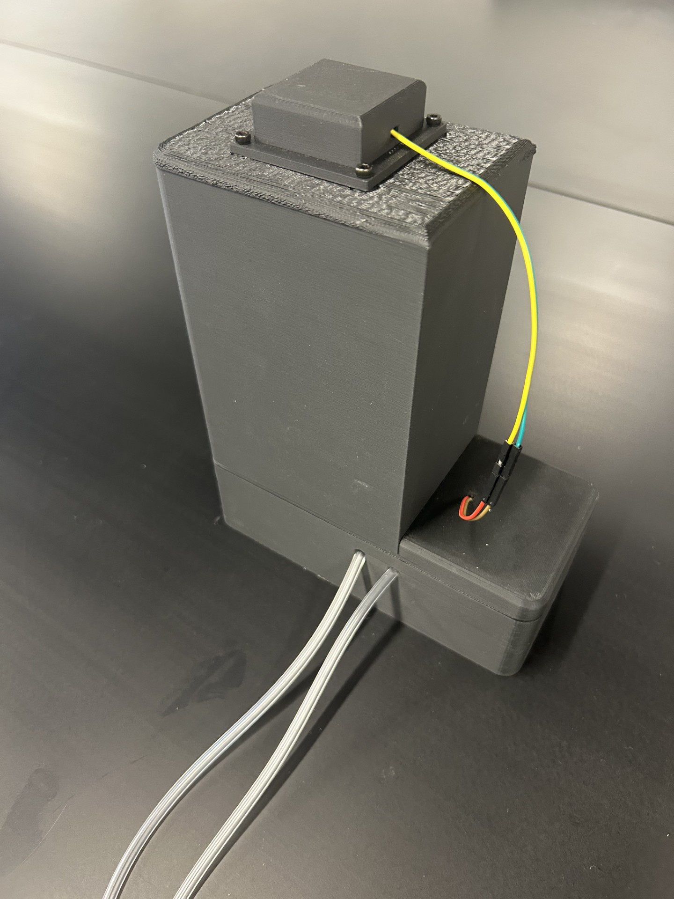
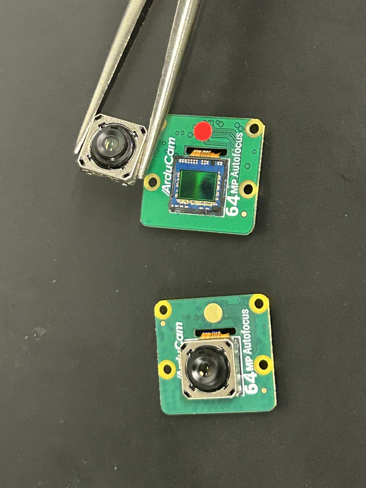
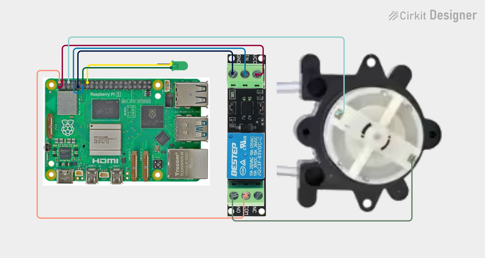
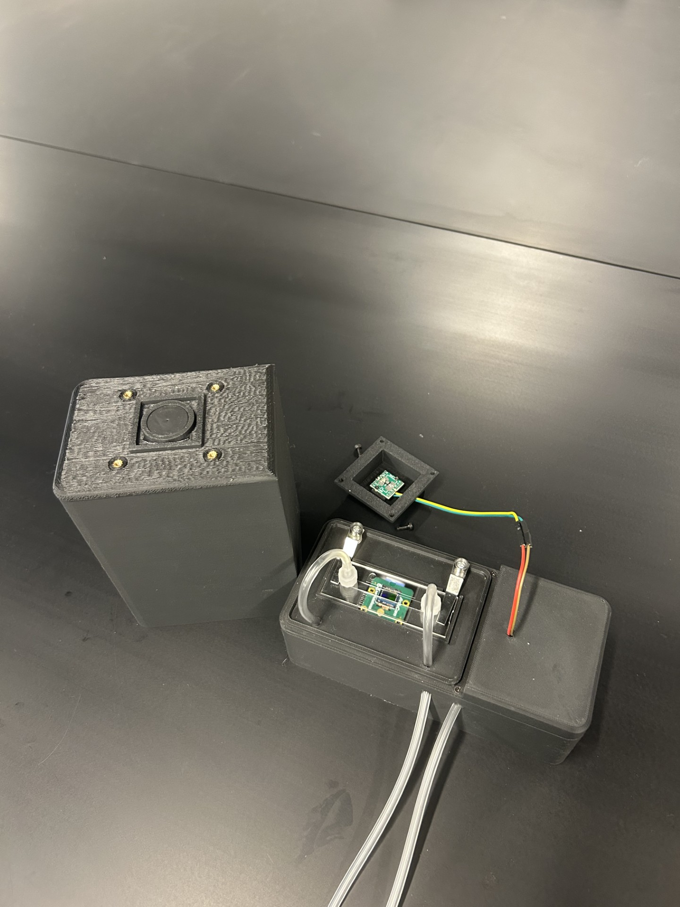
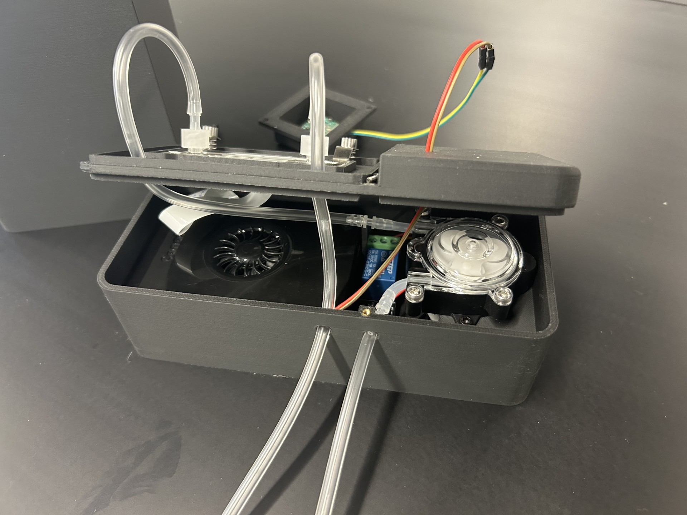

Lensfree Microscope for Quantification of Bacteria in Water
========================

  
  

Overview
-----------------
Water quality monitoring is essential for controlling pollutants and pathogens that can cause damage to the environment and human health. Traditional water quality monitoring involves gathering samples to send to laboratories, where water quality analysis is performed by qualified professionals, usually with the use of costly equipment. This is expensive and time consuming, which limits possible response to these pollutants and pathogens. Therefore, much effort has been put into developing technologies for low cost, in-situ water quality monitoring, including the use of in-situ microscopy. Despite this, lensfree imaging has not been explored for this purpose. Lensfree imaging is a form of microscopy that utilizes a partially coherent light source, a transparent sample, and a CMOS or CCD image sensor. Because the light is sufficiently coherent, the image can be digitally reconstructed to a higher degree of accuracy using holographic reconstruction. This makes lens-free holographic imaging an inexpensive way to accurately image an array of small particles, including microparticles, proteins, and cells. When compared to traditional microscopy, lensfree imaging has a higher field of view and is more cost effective, making it more applicable for in-situ sampling of large amounts of water. Here, I share my low-cost, lensfree holographic imaging system designed to monitor filamentous bacteria in activated sludge and cyanobacteria in ponds and lakes.

Hardware
-----------------
- [Raspberry Pi 5 with canakit case](https://www.amazon.com/CanaKit-Raspberry-Starter-Kit-PRO/dp/B0CRSNCJ6Y)
- [Arducam 64 MP Hawkeye camera](https://www.amazon.com/Arducam-High-Resolution-Autofocus-Raspberry-Compatible/dp/B0B63PCZM9)
- [Relay](https://www.amazon.com/Channel-Optocoupler-Isolated-Control-Arduino/dp/B07XGZSYJV)
- [Peristaltic pump](https://www.amazon.com/dp/B0C3D35M3N)
- [LED](https://www.mouser.com/ProductDetail/ams-OSRAM/LT-T64G-EAFB-29-N424?qs=BJlw7L4Cy794tt5HXlgN7A%3D%3D) and [Board](https://www.amazon.com/SOP14-SSOP14-TSSOP14-Adapter-1-27mm/dp/B081VNTJ15)
- [Threaded inserts](https://www.amazon.com/Ktehloy-Threaded-Assortment-Printing-Components/dp/B0CLKDPN65/)
- Screws [1](https://www.amazon.com/Screws-Assortment-Metric-Machine-Washers/dp/B0DPX1X3P1) & [2](https://www.amazon.com/1760pcs-Metric-Assortment-Upgrade-Wrenches/dp/B0C38YFL3D/), or find a better assortment for the screws listed in the assembly
- [Tubing](https://www.amazon.com/dp/B0CC312XMC)
- [Microscope clips (x2)](https://www.amazon.com/Stainless-Presser-Biological-Microscope-Digital/dp/B0CZRHGV5W/)
- [Wires](https://www.amazon.com/Elegoo-EL-CP-004-Multicolored-Breadboard-arduino/dp/B01EV70C78)
- [Leur Lock connector](https://www.amazon.com/MEETOOT-Laboratory-Biochemical-Analytical-Instruments/dp/B09PTX6M2Z)
- [µ-Slide 0.2 channel height 250 µm](https://ibidi.com/channel-slides/244-4645--slide-i-luer-glass-bottom.html#/29-surface_modification-15h_170_%C2%B5m_5_%C2%B5m_d_263_m_schott_glass_sterilized/33-pcs_box-15_individually_packed/318-channel_version_channel_height-02_channel_height_250_%C2%B5m) (you can likely get a free sample)
- [Light absorbing aluminum foil](https://www.amazon.com/9-8feet-Photography-Masking-Controlling-Lighting/dp/B0D7F11XWP)
- [3D printed container.](https://www.thingiverse.com/thing:7147444) There are 5 pieces:
  - *BASE*
  - *MIDDLE*
  - *TOP*
  - *HAT*
  - *HAT RING*
    

Assembly
-----------------
- Using a set of needle nose pliers, remove the lens from the camera
  - Be careful, as this step can damage or completely break your camera
  - I have found that grabbing the lens as shown below, then twisting as if tightening a bottle, works well

 

  

    
- Assemble the canakit for the Raspberry Pi, as shown [here](https://www.youtube.com/watch?v=Wi_S7QkuN3M&t=150s)
- Follow the wiring diagram below
  - You will need to solder the LED to its board, as well as the wires to that board
  - Also solder wires to the peristaltic pump

  

- Create the pinhole shown below (left)
  - Cut a small square of black aluminum foil, and place it over the circle on the *TOP* 3D printed piece
  - Then press the *HAT RING* onto the *TOP*, clamping the aluminum in place
  - Lastly poke a small hole into the center of the aluminum
- Add the microscope slide holders shown below (left)
  - These holders are slightly too big, and need to be cut down on each side to allow toe *TOP* to fit on the *MIDDLE*
  - Mount the holders using the two big holes in *MIDDLE* that are next to the spaces in the rectangle (far side in image below)

  
  

- Next, screw everything together, using a soldering iron to place the threaded inserts (TI)
  - Relay to *BASE*
    - M2.5 × 4 TI (x4)
    - M2.5 × 6 screw (x4)
  - Pump to *BASE*
    - M3 × 6 TI (x2)
    - M3 × 8 screw (x2)
  - Camera to *MIDDLE*
    - M2.5 × 4 screw (x4)
    - Screw into the pcb from below, as there needs to be as little space as possible between the camera and microscope slide
  - Hat to Top:
    - M3 × 6 × 5 TI
 - M3 × 8 screw

LED to Hat:
 - M2 × 4 × 3.2 TI
 - M2 × 6 screw

Middle to Base:
 - M2 × 4 TI
 - M2 × 6 screw

Pump to Base:
 - M3 × 6 TI
 - M3 × 8 screw

Relay to Base:
 - M2.5 × 4 TI
 - M2.5 × 6 screw

Camera to Middle:
 - M2.5 × 4 screw

RASPBERRY PI SETUP
------------------
System:
 - Raspberry Pi 5
 - Raspberry Pi OS (64-bit, Bookworm)

Camera Setup:
 1. Download and install Arducam packages:
    wget -O install_pivariety_pkgs.sh https://github.com/ArduCAM/Arducam-Pivariety-V4L2-Driver/releases/download/install_script/install_pivariety_pkgs.sh
    chmod +x install_pivariety_pkgs.sh
    ./install_pivariety_pkgs.sh -p libcamera_dev
    ./install_pivariety_pkgs.sh -p libcamera_apps

 2. Edit config file:
    sudo nano /boot/firmware/config.txt
    Under [all], add:
      dtoverlay=arducam-64mp

 3. Save and reboot.

 4. Test camera:
    libcamera-still -t 5000

PYTHON SETUP
------------
 1. Create the following folders on Desktop:
    - filamentous_system
    - electronics_test

 2. Move project files into these folders.

 3. Install OpenCV:
    sudo apt update
    sudo apt install python3-opencv

WIRING
------
LED:
 - Pin 12 → GPIO 18 (signal)
 - Pin 14 → GND

Pump + Relay:
 - Pin 1  → 3.3V → VCC on relay
 - Pin 2  → 5V   → COM on relay
 - Pin 9  → GND  → GND on relay
 - Pin 6  → GND  → GND on pump
 - Pin 11 → GPIO 17 → IN on relay
 - Relay NO → Pump power line

TESTING
-------
 1. Take a test picture.
 2. Adjust brightness if needed.

AUTOMATION
----------
Set cron job to run every 15 minutes:

  crontab -e

Add the following line:

  */15 * * * * cd /home/jacob/Desktop/filamentous_system && /usr/bin/python3 filamentous.py >> filamentous.log 2>&1
